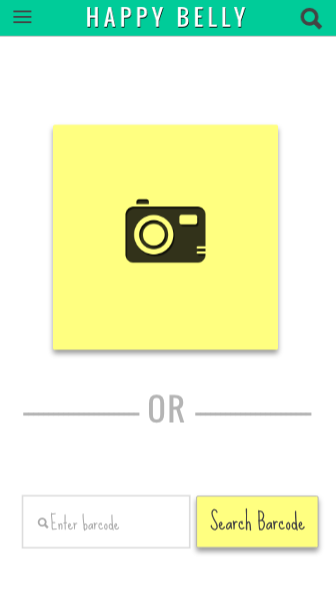

# Makers Academy Final Project

<p align="center">

</p>

<p align="center">

</p>


About
-----

The app is designed to help people with food allergies or dietary requirements quickly know whether they can eat a certain food.
It also has a [rails backend] (https://github.com/harrim91/allergy_scanner_backend).

User Stories
------------
```
So that I can find can quickly check ingredients for a specific product,
I want to be able to access this information via the products barcode.

So that I can filter what I cannot eat,
I want to be able to flag specific foods that I can't eat.

So that I can quickly set preferences,
I want to be able to choose default diet profiles.

So that the app can remember what I can't eat,
I want to be able to save details to my user account.

So that I can quickly decide whether I can eat something,
I want to be told if the product I have searched for contains an ingredient I have flagged.

So that I can quickly find the product,
I want to be able to scan the barcode.

```

Installation
-------
- Clone this repo `git clone git@github.com:harrim91/allergy_scanner_frontend.git`
- Ensure you have node.js, bower, grunt and ionic installed.
- `npm install`
- `bower install`
- To run the app in your browser - `grunt serve`

Use
-------
- Sign up for an account and select which default profiles you want to apply to you.
- Each default profile has the flagged ingredients listed.
- Once you save this information, you are taken to your profile page, listing all of the ingredients you can't eat.
- Click the search button in the top right of the screen
- On the search page, scan a barcode, or enter a barcode number of a food product.
- This searches the [Open Food Facts API](http://world.openfoodfacts.org/data) for matches
- If a match if found, the product name and ingredients will be displayed, along with a message indicating whether or not the product contains ingredients which you can't eat.

Click [here] (https://www.youtube.com/watch?v=nXFJiu1-xMI&feature=youtu.be) to watch the demo.


Authors
-------
- [Alex Robertson](https://github.com/OMGDuke)
- [Mara Wanot](https://github.com/GeekG1rl)
- [Michael Harrison](https://github.com/harrim91)
- [Sity Shah](https://github.com/sitypop)
